# HOW TO SUBSCRIBE TO AN API AND INVOKE IT

In order to consume APIs in your applications, you have to **create an application** in WSO2 API-M and **subscribe all APIs to it**. The subscription process fulfills the authentication process and provides you with access tokens that you can use to invoke an API.

An WSO2 application is a logical representation of a physical application such as a mobile app, webapp, device, etc. A single application can have multiple API subscriptions. Each application has a **consumer key and consumer secret pair**. The requests to the subscribed APIs are authenticated via the tokens. 

Application allow you to:
- Generate and use a single key for multiple APIs
- Subscribe multiple times to a single API with different Service Level Agreements (SLAs)/business plans which operate on per access token basis

## Subscribe to an API and test it
You can subscribe to an application using 2 methods available in the overview of the API:
1. Key generation wizard - it prompts you to create the new application.
1. Subscribe to an application - it allows you to subscribe to an existing application.

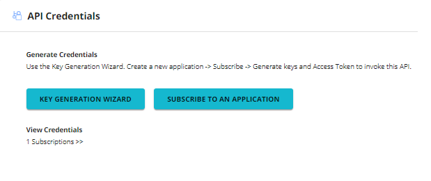

## Create new application using Key Generation Wizard
- Click on KEY GENERATION WIZARD
- Enter the application details by filling in:
    - Application name - use the name that is meaningful for you
    - Per token quota (choose from the list)
    - Token Type - OAUTH
    - Application description - describe application
- Click on NEXT button

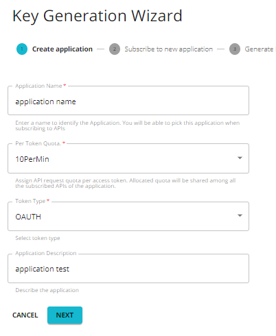

- Select the preferred throttling policy and click on NEXT

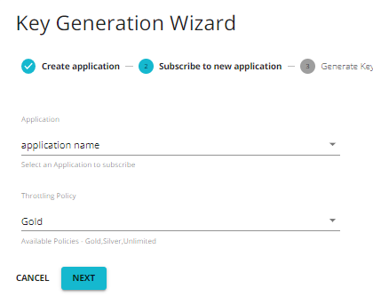

- Generate application keys and secret by clicking on NEXT

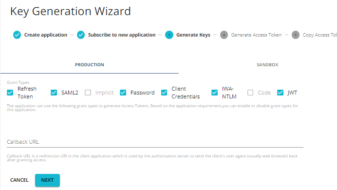

- Select the access token validity period then click NEXT (you can leave it as it is)

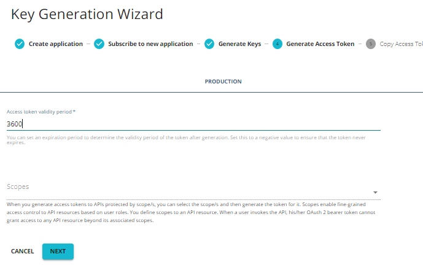

- Copy the access token
- Click FINISH to complete the wizard

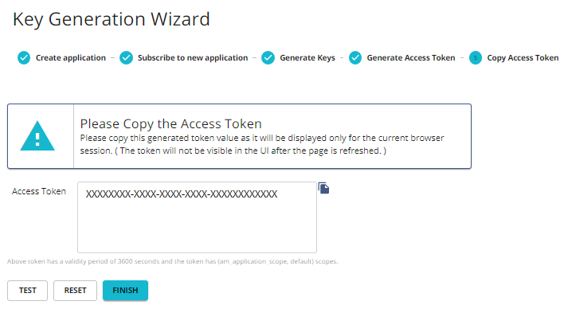

## Subscribe API to an existing application
- Go to Overview tab of an API

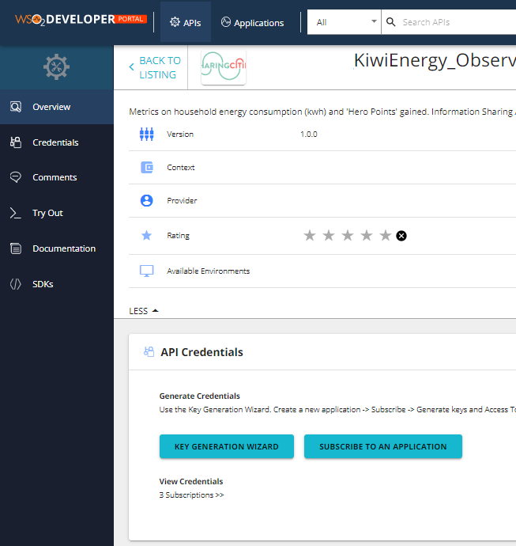

- Click on SUBSCRIBE TO AN APPLICATION
- Choose existing application from the list of Applications
- Choose throttling policy from the list of available policies
- Click on SUBSCRIBE

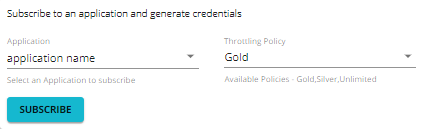

- The application name will be listed under "View Credentials" section on the bottom of the screen.

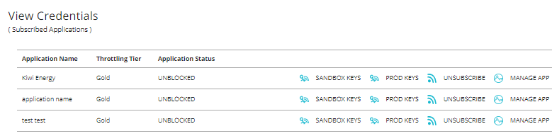

## Test the invoked API
- Click on Credentials tab of an API

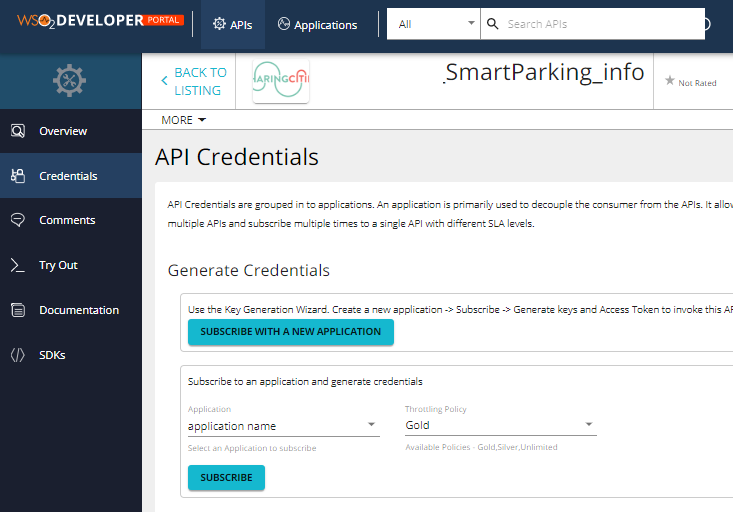

- Go to "View Credentials" section on the bottom of the screen and click on PROD KEYS
- Click on GENERATE ACCESS TOKEN

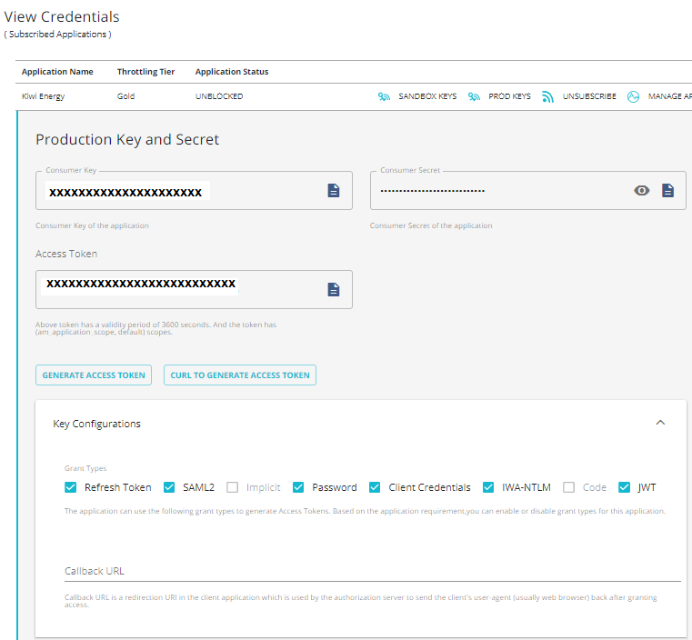

- Update Access token validity period if necessary and click on GENERATE

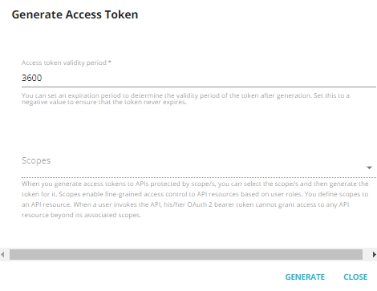
- This will generate the new access token that can be used for testing
- Click on CLOSE
- Click on "Try Out" tab of an API

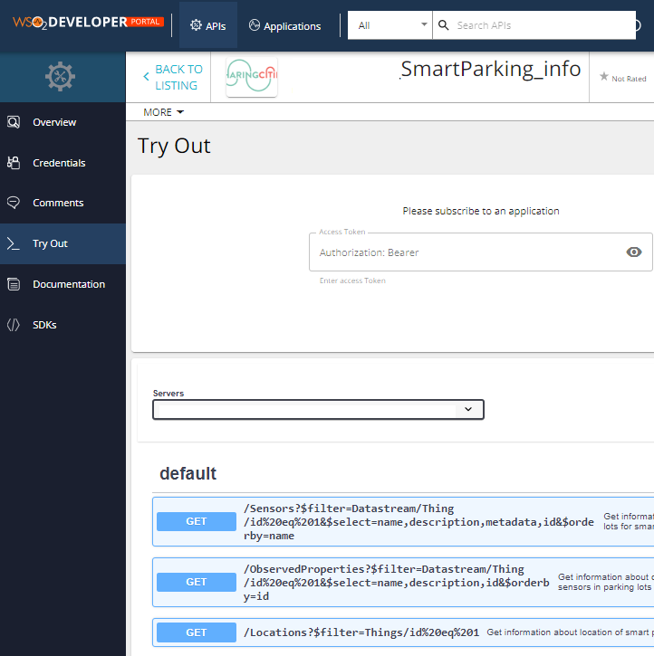

- This will open the swagger UI to test the chosen API
- Choose GET method from the list below and click on it
- Click on TRY IT OUT

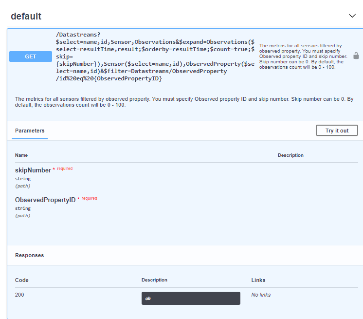

- Fill in the required parameters
- Click on EXECUTE

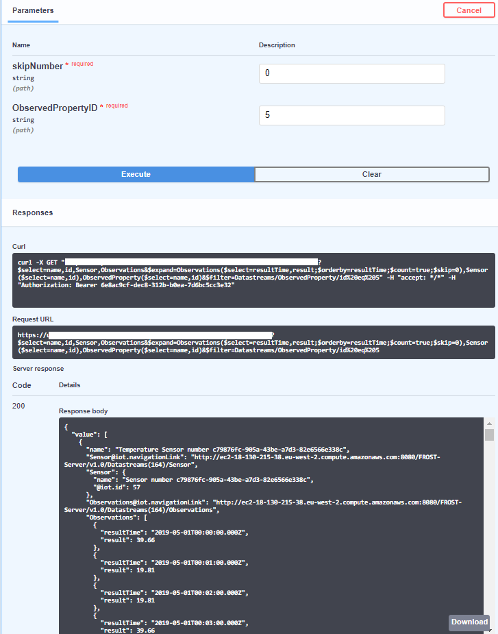

- Check that the response is successful after executing. The response code should be 200 and the response body should display data from the response.