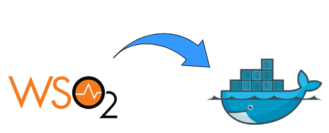
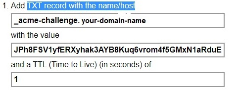

# Configure dockerized WSO2 API manager v3.0 with Identity Server as Key Manager and API Manager Analytics Support


In order to be able to use WSO2 API manager docker-compose with all its modules, we must change the default configuration in docker host volumes. In addition, we must add jar file for mysql database to the cotainer and update other configurations in WSO2 APIM carbon.

This document will describe the process of configuring WSO2 APIM docker host volumes and other parts of WSO2 APIM. 

> Volumes are directories (or files) that are outside of the default Union File System (Docker layer) and exist as normal directories and files on the host filesystem.
> [View more info about volumes.](https://blog.container-solutions.com/understanding-volumes-docker "Named link title"). 

The updates you will need to do, are listed below: 
1. Update Keystores with the SSL/TLS certificate in docker volume
2. Update configuration files in docker volumes
3. Add jar file for mysql database to APIM and IS containers
4. Update callback URL in carbon

## 1.  Update keystore with SSL/TLS certificate
In order to be able to use WSO2 installed on the server, we must update keystores with TLS/SSL certificate for the domain you set up for your WSO2 APIM. 

#### Step 1:  Set up the domain used for WSO2 APIM
1. Get the domain used for WSO2 APIM  - I used [GoDaddy](https://dcc.godaddy.com/domains/ "Named link title") website
2. Create new hosted zone in AWS Route53 service for the domain acquired in the previous step
3. Update DNS info of the domain in [GoDaddy](https://dcc.godaddy.com/domains/ "Named link title") by following steps below:
    1. Go to your domain's settings in GoDaddy
    2. Click on "Manage DNS"
    3. Edit Nameservers:
        - Click on checkbox "I'll use my own nameservers"
        - Add nameservers listed in AWS Route53 Hosted zone details. For example:
            - ns-xxxx.awsdns-xx.co.uk
            - ns-xxxx.awsdns-xx.org
            - ns-xxx.awsdns-xx.net
            - ns-xxx.awsdns-xx.com

#### Step 2:  Get TLS/SSL certificate for your domain
1. Backup the existing keystores (for APIM, Analytics Dashboard and Identity Server) and create the new keystores for your domain
    ```bash
    sudo su wso2docker

    cd ~/docker-apim/docker-compose/apim-is-as-km-with-analytics/apim/artifact/repository/resources/security

    mv wso2carbon.jks wso2carbon.jks.old

    keytool -genkey -alias wso2carbon -keyalg RSA -keysize 2048 -keystore wso2carbon.jks -dname "CN=usplondon.uk" -storepass w -keypass wso2carbon

    cd ~/docker-apim/docker-compose/apim-is-as-km-with-analytics/apim-analytics-dashboard/artifact/resources/security

    mv wso2carbon.jks wso2carbon.jks.old

    cd ~/docker-apim/docker-compose/apim-is-as-km-with-analytics/is-as-km/artifact/repository/resources/security

    mv wso2carbon.jks wso2carbon.jks.old
    ```
2. Get CSR (Certificate Signing Request)
    ```bash
    sudo su wso2docker

    cd ~/docker-apim/docker-compose/apim-is-as-km-with-analytics/apim/artifact/repository/resources/security

    mkdir ssl

    keytool -certreq -file ssl/newcertreq.csr -keystore wso2carbon.jks
    ```
3. Get free TLS/SSL certificate from [SSL for free website](https://sslforfree.com)
    - Enter your domain name and click on "Create Free SSL Certificate"
    - If you use domain without "www", click on "Add/Edit Domains" and remove domain with www prefix in the box
    - Click on "Manual Verification (DNS)"
    - Click on "Manually Verify Domain"
    - Create TXT record in AWS Route53 hosted zone and fill in the information from sslforfree website (see the picture below) as follow:
        - Click on Create Record Set in AWS Route53 Hosted zone for your domain
        - TXT record will have name, TTL and value copied from sslforfreee website (see the image below):
            - Name: _acme-challenge.your-domain-name
            - Type: "TXT - Text"
            - TTL(Seconds): 1
            - Value: JPh8FSV1yfERXyhak3AYB8Kuq6vrom4f5GMxN1aRduE  

    - Once the TXT record is created in AWS Route 53 hosted zone you need to go to SSLforfree website and wait for few minutes
    - Verify TXT record by clicking on the link in SSLforfree website saying "Verify _acme-challenge.your-domain-name"
    - Once there are no errors and the TXT record is verified check the checkbox saying "I have My Own CSR".
    - Copy the text from .csr file created in second point to the textbox with caption "Enter your CSR here"
    - Delete word ‘New' at the beginning and at the end of the certificate request (see below)

    ```
    -----BEGIN CERTIFICATE REQUEST-----
    MIIC0TCCAbkCAQAwXDELMAkGA1UEBhMCTEsxCzAJBgNVBAgTAldTMQswCQYDVQQH
    EwJTTDENMAsGA1UEChMESG9tZTENMAsGA1UECxMESG9tZTEVMBMGA1UEAxMMdXNw
    bG9uZG9uLnVrMIIBIjANBgkqhkiG9w0BAQEFAAOCAQ8AMIIBCgKCAQEAj19DANTj
    gFaNzobthHYKf8m4QExWDZEVwGtZAdHjcroypdFNWffzHVkfZYHvzuLs42SI7T6c
    0Wnlr2dwktvMbe9R6BCglVvMGuoaR8qV80qIAzSZiCriRdadwHIesl3UMcOAC/Pw
    ZOmrzwg6uN90fm9wIOKpha2kBGokGPTnQIn2Ww+aX4wJUdMGzcy14I3ORmAcb9LZ
    bczWKPGEneYJRKZds83WOP38hpT3f5HqrBvV8oZ3IrWOsfCcbu9nMwfER2w13135
    5ZlRwLeaxJBjf6X4o0+S2gVNN/TLNdwc1xhj0aTdY+UfVWebHUQfhepmAAxvWyuR
    fXInuvUaE8sfMwIDAQABoDAwLgYJKoZIhvcNAQkOMSEwHzAdBgNVHQ4EFgQUBKxm
    O2xXrIzo2X9qZhQWwPL4mFUwDQYJKoZIhvcNAQELBQADggEBAGX3EsDftd93ytDO
    XIHS0Z9BBRSBrTKSvm7I4b9BnwtlSsmu/v264lxVY4S2O3z572hormhGncUXwHiR
    5bTBdIabQAOezgchto4ZMPvM+MKr8Eqe8ECbZBKxrEPjDeKX88KEb+O+zqLEusbW
    oF7xgbZ58BHuDMr/iOQWUOK9IyFAAr+drH5rPehIawSDkR4F8Ho+UPvWUZ9TM97z
    ZcfoG3C+5NEZmZZyv+80YZYm+G0pkYNh4N/cHEqcC3/iHGTbXOJ1tTClCtX+pjY2
    +09J9n0NllXRj4V++U0Z5EJv9/1D2tmEuPbSKnVfiNdeXagSvVy02jp08CWHyMQN
    DzAOPtQ=
    -----END CERTIFICATE REQUEST-----
    ```
    - Click on Download SSL Certificate
    - Download certificate files (ca_bundle.csr, certificate.csr, private.key)
    - Copy certificate files from local machine to Ubuntu server to container volume folder:

    ```bash
    pscp -r -i "location\of\ppkkey\for\ubuntuServer\nameOfKey.ppk" C:\Users\xxxx\Downloads\sslforfree_new ubuntu@ec2-x-x-xxx-xxx.eu-west-x.compute.amazonaws.com:/home/ubuntu/temp

    cp -i /home/ubuntu/temp ~/docker-apim/docker-compose/apim-is-as-km-with-analytics/apim/artifact/repository/resources/security/ssl
    ```
#### Step 3: Import TLS/SSL certificate to keystores within APIM, Analytics Dashboard and Identity server containers.
1. Import certificates to new keystore in APIM
    ```bash
    sudo su "dockerusername"

    cd ~/docker-apim/docker-compose/apim-is-as-km-with-analytics/apim/artifact/repository/resources/security

    keytool -importcert -trustcacerts -alias intermediateRootCert -file ssl/ca_bundle.crt -keystore wso2carbon.jks

    keytool -importcert -trustcacerts -alias wso2carbon -file ssl/certificate.crt -keystore wso2carbon.jks
    ```
2. Import certificate from wso2carbon.jks keystore to trustore.jks
    ```bash
    sudo su "dockerusername" 

    cd ~/docker-apim/docker-compose/apim-is-as-km-with-analytics/apim/artifact/repository/resources/security

    keytool -export -alias wso2carbon -file ssl/wso2carbon.pem -keystore wso2carbon.jks -storepass wso2carbon

    keytool -import -alias wso2carbon -file ssl/wso2carbon.pem -keystore client-truststore.jks -storepass wso2carbon
    ```

    If the trustore contains wso2carbon.jks keystore, you won't be allowed to import wso2carbon.jks. Thus, we must delete it using command below and afterwards we could import the new wso2carbon.jks keystore. 

    ```bash
    sudo su "dockerusername"

    cd ~/docker-apim/docker-compose/apim-is-as-km-with-analytics/apim/artifact/repository/resources/security

    keytool -delete -alias wso2carbon -keystore wso2carbon.jks -storepass wso2carbon

    keytool -import -alias wso2carbon -file ssl/wso2carbon.pem -keystore client-truststore.jks -storepass wso2carbon
    ```

3. Check that the certificate was added to trustore (wso2carbon.jks keystore should be listed)
    
    ```bash
    sudo su "dockerusername"

    cd ~/docker-apim/docker-compose/apim-is-as-km-with-analytics/apim/artifact/repository/resources/security

    keytool -list -keystore wso2carbon.jks -v
    ```
4. Import newly updated keystore wso2carbon.jks from APIM to Analytics Dashboard and Identity Server containers and update trustore in these containers
    - Import wso2carbon.jks
    ```bash
    sudo su "dockerusername"

    cd ~/docker-apim/docker-compose/apim-is-as-km-with-analytics/apim/artifact/repository/resources/security

     cp wso2carbon.jks ~/docker-apim/docker-compose/apim-is-as-km-with-analytics/apim-analytics-dashboard/artifact/resources/security

     cp wso2carbon.jks ~/docker-apim/docker-compose/apim-is-as-km-with-analytics/is-as-km/artifact/repository/resources/security
    ```
    - Update trustore with the new wso2carbon.jks keystore in Analytics Dashboard and Identity Server

    ```bash
    sudo su "dockerusername"

    cd ~/docker-apim/docker-compose/apim-is-as-km-with-analytics/apim-analytics-dashboard/artifact/resources/security

    mkdir ssl

    keytool -export -alias wso2carbon -file ssl/wso2carbon.pem -keystore wso2carbon.jks -storepass wso2carbon

    keytool -import -alias wso2carbon -file ssl/wso2carbon.pem -keystore client-truststore.jks -storepass wso2carbon

    keytool -list -keystore wso2carbon.jks -v 

     cd ~/docker-apim/docker-compose/apim-is-as-km-with-analytics/is-as-km/artifact/repository/resources/security

     mkdir ssl

     keytool -export -alias wso2carbon -file ssl/wso2carbon.pem -keystore wso2carbon.jks -storepass wso2carbon

    keytool -import -alias wso2carbon -file ssl/wso2carbon.pem -keystore client-truststore.jks -storepass wso2carbon

    keytool -list -keystore wso2carbon.jks -v 
    ```
#### Step 4: Restart all containers updated in the previous steps
1. Restart container for APIM, IS as KM and Analytics Dashboard
    ```bash
    docker ps

    docker restart "container ID"
    ```
2. Once the containers are restarted, check that Status of containers are healthy. If they are not healthy, check logs of unhealthy container to resolve the issue.
    ```bash
    docker ps

    docker logs "container ID"
    ```

## 2. Update configuration files in container volumes
Configuration files that are going to be udpated are in the different locations:
1. Update config file for WSO2 APIM container
```bash
sudo su "dockerusername"

cd ~/docker-apim/docker-compose/apim-is-as-km-with-analytics/apim/config/repository/conf

sudo vim deployment.toml
```
Update the config file with the following:

```
[server]
hostname = "your-domain-name"

[[apim.gateway.environment]]
ws_endpoint = "ws://your-domain-name:9099"
wss_endpoint = "wss://your-domain-name:8099"
http_endpoint = "http://your-domain-name:${http.nio.port}"
https_endpoint = "https://your-domain-name:${https.nio.port}"

[apim.analytics]
enable = true
store_api_url = "https://your-domain-name:7444"

[apim.key_manager]
service_url = "https://your-domain-name:${mgt.transport.https.port}/services/"

[apim.devportal]
url = "https://your-domain-name:${mgt.transport.https.port}/devportal"

```

2. Update config file for WSO2 Identity server container
```bash
sudo su "dockerusername"

cd ~/docker-apim/docker-compose/apim-is-as-km-with-analytics/is-as-km/config/repository/conf

sudo vim deployment.toml
```
Update the config file with the following:

```
[server]
hostname = "your-domain-name"

[apim.throttling]
receiver_url = "tcp://your-domain-name.uk:9611"
receiver_auth_url = "ssl://your-domain-name.uk:9711"

```

3. Update config file for WSO2 Analytics dashboard container
```bash
sudo su "dockerusername"
cd ~/docker-apim/docker-compose/apim-is-as-km-with-analytics/is-as-km/config/repository/conf
sudo vim deployment.yaml
```
Update the config file with the following:

```
auth.configs:
  type: apim
  ssoEnabled: true
  properties:
    adminScope: apim_analytics:admin_carbon.super
    allScopes: apim_analytics:admin apim_analytics:product_manager apim_analytics:api_developer apim_analytics:app_developer apim_analytics:devops_engineer apim_analytics:analytics_viewer apim_analytics:everyone openid apim:api_view apim:subscribe
    adminServiceBaseUrl: https://your-domain-name:9443
    adminUsername: admin
    adminPassword: admin
    kmDcrUrl: https://your-domain-name:9443/client-registration/v0.15/register
    kmTokenUrlForRedirection: https://your-domain-name:9443/oauth2
    kmTokenUrl: https://your-domain-name:9443/oauth2
    kmUsername: admin
    kmPassword: admin
    portalAppContext: analytics-dashboard
    businessRulesAppContext : business-rules
    cacheTimeout: 900
    baseUrl: https://your-domain-name:9643
    grantType: authorization_code
    publisherUrl: https://your-domain-name:9443
    storeUrl: https://usplondon.uk:9443
```

## 3. Add jar file for mysql database
Download jar file for mysql database from website to temp file on your server. Unzip it and copy it to the folder within WSO2 APIM and WSO2 IS containers.  
```bash
sudo su "dockerusername"

cd ~

mkdir temp

cd ~/temp

curl https://cdn.mysql.com//Downloads/Connector-J/mysql-connector-java-8.0.19.zip --output mysql-connector-java-8.0.19.zip

unzip mysql-connector-java-8.0.19.zip

docker cp mysql-connector-java-8.0.19\mysql-connector-java-8.0.19.jar name-for-apim-container:/home/wso2docker/wso2am-3.0.0/repository/components/lib

docker cp mysql-connector-java-8.0.19\mysql-connector-java-8.0.19.jar name-for-is-as-km-container:/home/wso2docker/wso2is-km-5.9.0/repository/components/lib
```

## 4. Update callback URL in carbon
1. Log into carbon as admin - https://your-domain-name:9443/carbon
2. Click on Main >> Service Providers >> List
3. Edit admin_admin_store and admin_admin_publisher service provider
    - Edit >> Inbound Authentication Configuration >> OAuth/OpenID Connect Configuration >> Edit
    - Update Callback URL regexp=(https://your-domain-name:9443/devportal/services/auth/callback/login|https://your-domain-name:9443/devportal/services/auth/callback/logout)