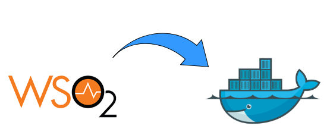

# Installing dockerized WSO2 API manager v3.0 with Identity Server as Key Manager and API Manager Analytics Support on Ubuntu 18.0 server on AWS.


WSO2 API Manager (APIM) can be easily installed using Docker containers by following the steps below.

### Step 1: Create AWS EC2 instance - Ubuntu server 
- Launch new instance
- Choose AMI Ubuntu 18.04 LTS
- Choose an instance type - __it must be c5.xlarge or larger__
- Add storage
- Set up security groups

### Step 2: Configure Ubuntu server
- In order to set up ubuntu server for WSO2 follow the following steps:
```bash
sudo apt-get update
sudo apt-get upgrade
sudo apt-get autoremove
sudo apt-get autoclean
sudo apt-get install unzip
sudo apt-get install curl
```
### Step 3: Install docker
```bash
sudo apt install apt-transport-https ca-certificates curl software-properties-common
curl -fsSL https://download.docker.com/linux/ubuntu/gpg | sudo apt-key add -
sudo add-apt-repository "deb [arch=amd64] https://download.docker.com/linux/ubuntu bionic stable"
sudo apt-get update
apt-cache policy docker-ce
```

You will see output like this, although the version number for Docker may be different.
```bash
docker-ce:
  Installed: (none)
  Candidate: 18.03.1~ce~3-0~ubuntu
  Version table:
     18.03.1~ce~3-0~ubuntu 500
        500 https://download.docker.com/linux/ubuntu bionic/stable amd64 Packages
```

Finally, install Docker:
```bash
sudo apt-get install docker-ce
sudo systemctl status docker
```
The output should show that docker service is active and running:
```bash
docker.service - Docker Application Container Engine
   Loaded: loaded (/lib/systemd/system/docker.service; enabled; vendor preset: enabled)
   Active: active (running) since Thu 2018-07-05 15:08:39 UTC; 2min 55s ago
     Docs: https://docs.docker.com
 Main PID: 10096 (dockerd)
    Tasks: 16
   CGroup: /system.slice/docker.service
           ├─10096 /usr/bin/dockerd -H fd://
           └─10113 docker-containerd --config /var/run/docker/containerd/containerd.toml
```

### Step 4: Install Docker-compose
We’ll check the [current release](https://github.com/docker/compose/releases "Named link title") and if necessary, update it in the command below:
```bash
sudo curl -L https://github.com/docker/compose/releases/download/1.25.5/docker-compose-`uname -s`-`uname -m` -o /usr/local/bin/docker-compose
```
Next we will set the permission and verify that the installation was successful by checking the version:
```bash
sudo chmod +x /usr/local/bin/docker-compose

docker-compose --version
```
The output should be:
```bash
docker-compose version 1.25.5, build a133471
```

### Step 5: Create user on Ubuntu server used by docker
Create user with username and password and fill all necessary details:
```bash
sudo adduser "dockerusername"
sudo su "dockerusername"
sudo usermod -aG sudo "dockerusername"
sudo usermod -aG docker "dockerusername"
Id -nG
```
The output should be:
```bash
"dockerusername" sudo docker
```

### Step 6: Install WSO2 APIM
Clone the application from github. Make sure that you are signed under username created in the step 5.
```bash
cd ~

git clone https://github.com/wso2/docker-apim

cd ~/docker-apim/docker-compose/apim-is-as-km-with-analytics

docker-compose up
```
It will deploy the required containers for WSO2 APIM. The deployed containers are listed below.
- WSO2 Analytics Dashboard
- WSO2 AM (API manager)
- WSO2 IS-KM (Identity Server as Key Manager)
- WSO2 Analytics Worker
- MySQL database

Access the WSO2 API manager web UIs using the below URLs via a web browser.
```bash
https://localhost:9443/publisher
https://localhost:9443/devportal
https://localhost:9443/admin
https://localhost:9443/carbon
```

Please note that API Gateway will be available on following ports
```bash
https://localhost:8243
https://localhost:8280
```

Once WSO2 APIM docker containers are installed on the server, you will need to update the configuration of containers. See the document called [Configure dockerized WSO2 API manager v3.0 product on Ubuntu 18.0 server on AWS.](WSO2_apim_configuration.md "Named link title")