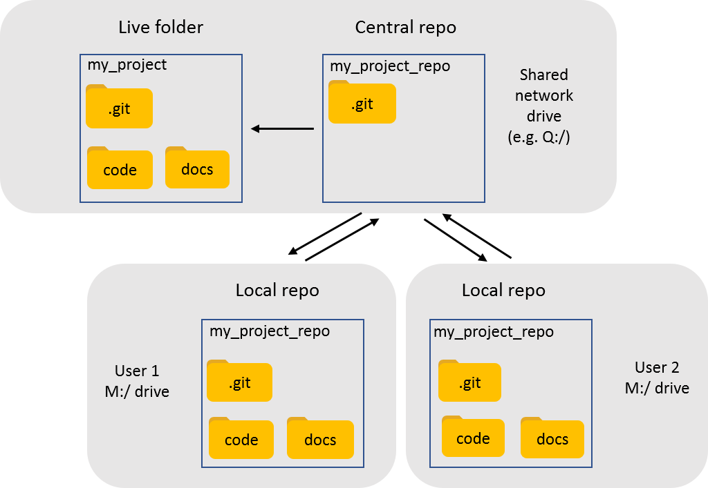

# Using a local repository 
Use this method if:
- You have sensitive data that cannot leave the GLA's servers
- You don't want to make your project public

## Description
The central repository is a folder called *my_project_repo* which contains a bare repository.  'Bare' means that you can't see any of the folder or file structures within the repository.  This ensures that nobody can edit the central repository directly and mess up the git workflow.

Each user clones the repository onto their M drive so that they have a local working copy.  When the central repository is cloned, a folder called *my_project_repo* will appear in the M drive with the folder and file structure visible inside.  Each user works on their local copy, and when ready pushes the changes up the central repository.

A hook saved in the .git folder of the central repository runs a script to update the live folder called *my_project' whenever a push is made to the central repository.  The live folder will be overwritten with whatever is on the master branch of the central repository.  Anyone with access to the live folder can look through the files and folders, and run any code there without upsetting the git workflow.  However, any changes made there will disappear the next time a push is made to the central repository.  This means that the live folder is essentially read-only.

## Schema


## Set-up steps
1. Create a folder for your central repo (e.g. *Q:/my_project_repo*)
1. Create a folder for your live project folder (e.g. *Q:/my_project*)
1. Initialise the central repo as a bare repo
    1. open git bash (see https://github.com/Greater-London-Authority/how-tos/blob/master/install_git_on_C.md for how to install)
    1. type `cd "Q:/my_poject_repo"` (replace the filepath with the filepath to your central repo)
    1. type `git init --bare` to initialise the repository
    1. the *my_project_repo* folder should now contain a bunch of git folders    
1. Create a text file called *post-receive* inside the hook folder in your central repo folder.  Ensure that the filename has no file extension.
1. Save the following into your *post-receive* file, replacing the file paths with your central repo and live project folders: 
    ```
    #!/bin/sh
  
    echo "Starting post-receive hook ... Q:/my_project_repo/hooks"
    echo "This hook checks out the master branch to the live verson at Q:/my_project"
    echo "Trying GIT_WORK_TREE='/q/my_project' git checkout $master --force"
    GIT_WORK_TREE='/q/my_project' git checkout $master --force
    echo "Finished."
    ```
1. Clone the central repo to your local workspace. In git bash type:
    1. `cd M:/`, replacing `M:/` with wherever you want to save your local copy to.
    1. `git clone "Q:/my_project_repo"`
1. Add some files to local local repo, commit and push
1. Check that your changes have propagated into the live project folder
1. If that worked you're ready to go! Do your work in your local repo, and push to and pull from the central bare repo to share work with others

# Using github
To be filled in... 
